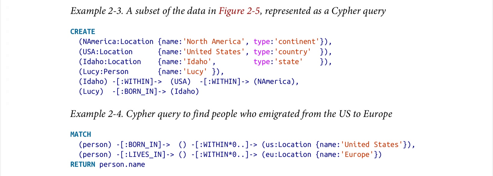
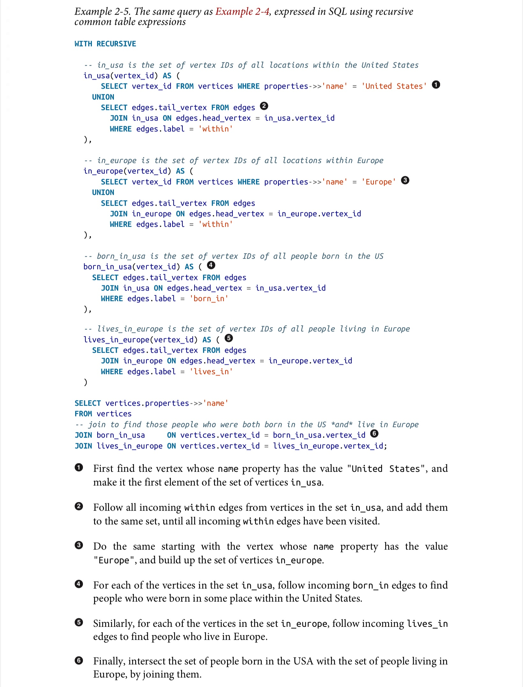
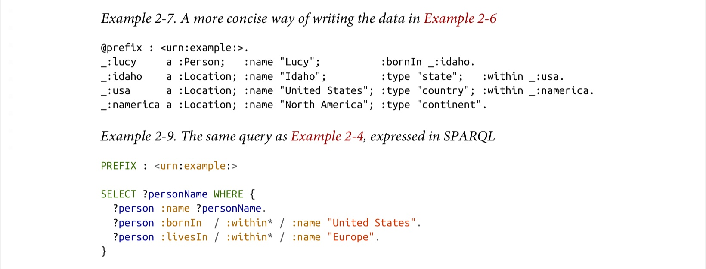

# Chapter 2

## Relational Model VS Document Model

Driving forces behind the adoption of NoSQL:
- Greater scalability (large datasets and high write throughput)
- Preference for free and open source software over commercial databases
- Specialized query operations not supported by SQL
- Restrictiveness of relational schemas and desire of more dynamic and expressive data model
- Relational database usually requires an extra ORM layer between database and application codes

Document model might seems closes the gap between storage layer and application codes, but since most document models are schemaless, it still has encoding issues

### One-to-many

Approaches to handle one-to-many relationships in relational model:
- Create separate tables and use foreign key
- Advanced datatype support from modern relational databases (e.g. JSON)
- Encode data into a JSON or XML format and store it as plain text, and let application codes to handle it

One-to-many relationship can be easily handled with document model by JSON/XML tree structure

### Many-to-one and Many-to-many

Reasons to normalize many-to-one relationships:
- Consistent style and spelling across profiles
- Avoiding ambiguity
- Ease of updating
- Localization support
- Better for searching

Handling many-to-one/many-to-many relationship is easy with relational model with separate tables and foreign keys

Most document databases do not support join operation, thus many-to-one/many-to-many has to be handled in application layer

### How to Choose

#### Relational Model

- Pros:
    - Better support for join and many-to-one/many-to-many relations
    - Strict schema, schema on write
- Cons:
    - Schema upgrade might be slow and might requires down time
    - Even with query optimizer and indexing, frequent multi-way joins could be expensive

#### Document Model

- Pros:
    - Schema flexibility, schema on read
    - Better performance due to locality
    - Closer to application layer
    - Easier for data locality for frequently used documents

- Cons:
    - Cannot refer directly to nested item
    - Huge documents seriously impact performance

## Query Languages

### Imperative and Declarative

Imperative language tells the computer to perform certain operations in a certain order

Declarative query language specifies the pattern of the data you want

Advantages of declarative query language:
- More concise and easier to work with
- Hides implementation details of the database engine
- Does not guarantee any ordering and doesn't mind if order changes
- Easier to be executed in parallel

### MapReduce Querying

Restrictions of MapReduce: those functions must be stateless functions that only uses the data passed to them as input. They cannot performance additional queries, and must not have side effects

MapReduce can be used to implement SQL query engines on distributed system

## Graph Data Models

Main advantages of Graph Data Model:
- More natural for handling complex many-to-many relations in data
- Not limited to homogeneous data, can provide a consistent way of storing completely different types of objects

### Property Graphs with Cypher Query Language

Basic structure of property graph model:
- Each vertex consists of:
    - A unique identifier
    - A set of outgoing edges
    - A set of incoming edges
    - A collection of properties (key-value pairs)
- Each Edge consists of:
    - A unique identifier
    - The vertex at which the edge starts (the tail vertex)
    - The vertex at which the edge ends (the head vertex)
    - A label to describe the kind of relationship between the two vertices
    - A collection of properties (key-value pairs)

Important aspects of property graph model:
- Any vertex can have an edge connection it with any other vertex
- Both incoming and outgoing edges can be efficiently found given any vertex, which helps easily traversing the graph
- Several different kinds of information can be stored in a single graph by using different labels for different relationships

Example of Cypher query language:

Graph data can be represented in a relational database, but could be cumbersome to query with SQL. As the number of joins is not fixed, recursive common table expressions must be used to achieve variable-length traversal paths in a query

### Triple-Stores with SPARQL

Basic structure of Triple-Store model: all information is stored in the form of three-part statements: `(subject, predicate, object)`, where the subject of a triple is equivalent to a vertex in a graph, and the object is either a value in a primitive datatype, or another vertex in the graph

*In another way, Triple-Store is essentially normalized property graph where each property is treated as a single vertex*

