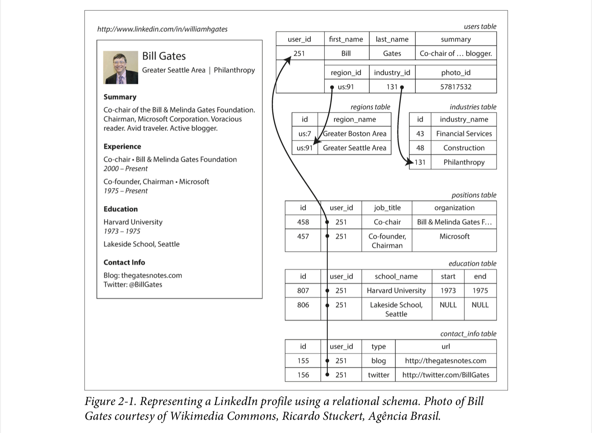
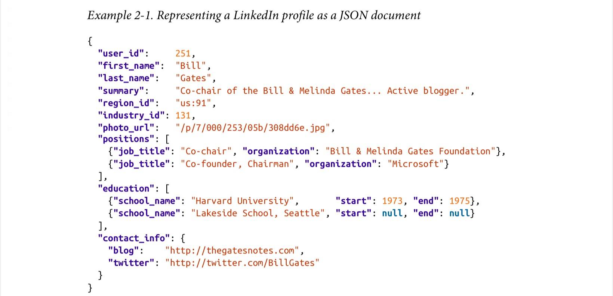

# Linkedin Profile Data Model Example

## Data Model Design with Relational Model

Note that for position/education/contact information, data is normalized with extra tables and foreign keys
To fetch the whole profile, you need to either perform multiple queries, or perform a multi-way join query

## Data Model Design with Document Model

